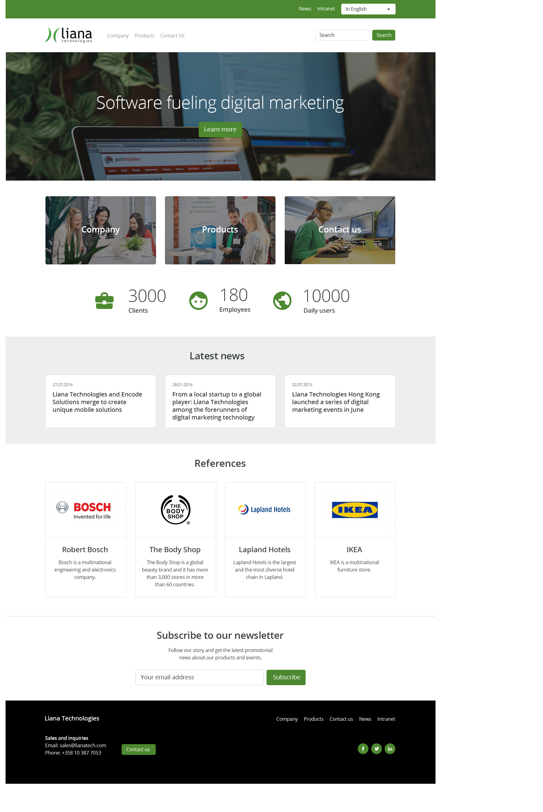

# Readme

This project is a coding assignment for Liana Technologies. Task was to recreate a basic HTML site based on a reference image and make it responsive. Project was made with HTML, CSS and vanilla JavaScript.

# Demo

[https://lianademo.lassesuomela.com](https://lianademo.lassesuomela.com)

## Extra content that I added

1. Latest News section fetches news from [RSS feed](https://www.lianatech.com/resources/blog.rss) and replaces the default three news with latest news from the feed. Used axios and JavaScript to achieve this.

2. Clients, Employees and Users sections numbers are animated to go from 0 to their target values. This was made with JavaScript.

3. Very basic way of subscribing to a newsletter by providing valid email address. This hides the subscribe to newsletter div and shows a thank you message. This was achieved with JavaScript.

## Screenshot from my recreation

## Reference image

